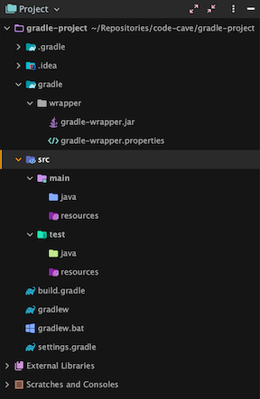

# Gradle Build Tool  
[Gradle](https://gradle.org) is an application build tool. A build tool is very useful for simplifying  
processes that you would run on an application such as compiling the code,  
running tests, packaging the project, importing library packages, and more.  
Gradle is the current build tool of choice for Java projects. [Maven](https://maven.apache.org) is another  
build tool. Even though it's older, it's still widely used because it's so reliable.  
Another build tool is [Ant](https://ant.apache.org). It's older, and rarely used in modern development.  
It's important to learn how to use a build tool well, as doing so will make life  
easier when building applications.

### Content:
- [Installing Gradle](#installing-gradle)
- [Creating A Gradle Project](#creating-a-gradle-project)
- [Gradle Build Config](#gradle-build-config)
- [Running Gradle Tasks](#running-gradle-tasks)

## Installing Gradle
[Installing Gradle](https://gradle.org/install) is pretty easy, there are a few ways to go about it:
- Install with [SDKMAN!](https://sdkman.io) (recommended):  
  `$ sdk install gradle 6.8.3` (or whichever version is the latest)  
  Installing via SDKMAN! will make it easier to change or update versions.
- Install with Linux package manager:  
  `$ sudo apt-get install gradle`
- Install with [Homebrew](https://brew.sh) (for Mac only):  
  `$ brew install gradle`
- Install manually:  
  Gradle can be installed manually as described [here](https://gradle.org/install/#manually).

There are other ways to install, like using a Linux package manager for instance.  
Whichever method used to install, it's normally better to use a package manager.

## Creating A Gradle Project
Creating a project in Gradle is very easy, as IDEs are well integrated with it.  
Each IDE is different, so exact steps won't be described for each, but generally,  
open a new project, select Gradle, then select Java and any additional libraries.  
Once a new Gradle project is created, it should look something like this:



The build.gradle file should be pretty bare, only containing this:
```groovy
plugins {
    id 'java'
}

group 'org.example'
version '1.0-SNAPSHOT'

repositories {
    mavenCentral()
}

dependencies {
    testImplementation 'org.junit.jupiter:junit-jupiter-api:5.6.0'
    testRuntimeOnly 'org.junit.jupiter:junit-jupiter-engine'
}

test {
    useJUnitPlatform()
}
```

Notice the directory gradle/wrapper that was created. The Gradle wrapper is a key  
feature of Gradle in that it's responsible for ensuring that a specific version of Gradle  
is used (the version on the machine that created the project) to run the Gradle tasks.  
This is important for compatibility reasons like when working on an old project that  
had an older version of Gradle, when building, that version of Gradle will be used.

That's all there is to it! A Gradle project was just created, so now it's time  
to fill out the content that will go in the build config.

## Gradle Build Config
Since Gradle is mostly used for building Java applications, Java will be the context  
of the build config here. The Gradle build config (build.gradle) is required in order  
to run tasks in a Gradle project because it defines constraints for the build processes.  
The documentation for [Gradle Java applications](https://docs.gradle.org/current/userguide/building_java_projects.html)
 is followed since it's the most relevant.  
**Note**: this is for a Java _**application**_, which is different than a Java _**library**_.  

Something that needs to be added is the **application** plugin. This can be swapped in  
for the **java** plugin since the **java** plugin is included in the **application** plugin.
```groovy
plugins {
    id 'application'
}
```

Other things that need to be added are the main class name and the Java version for  
the project:
```groovy
application {
    // Application is the usual name given to the main class in Spring Boot projects
    mainClass = 'com.company.project.Application'
}

java {
    toolchain {
        languageVersion = JavaLanguageVersion.of(11)
    }
}
```

Aside from dependencies (which can be found in the docs), this is all that's really  
needed for getting started with a Gradle Java application project. As dependencies  
are added in, however, the need for more configuration may arise.

Notice that in the Gradle toolbar in the IDE, there are tasks under build that can  
be run, also, there is a **run** task under application that can be used to run the  
application.  
**Note**: for Spring Boot projects, configuration may be needed for the run task.  

## Running Gradle Tasks
Before the tasks are able to be executed, there needs to be some initial code added.  
For brevity, just a main class and a single test class will be added in order to make  
the build tasks run successfully.  
Add in src/main/java/com/company/project/Application.java:
```java
package com.company.project;

public class Application {

    public static void main(String[] args) {
        System.out.println("Hello world");
    }
}
```

Add in src/test/java/com/company/project/ApplicationTest.java:
```java
package com.company.project;

import org.junit.jupiter.api.Test;

public class ApplicationTest {

    @Test
    public void testMain() {
        Application.main(null);
    }
}
```

With these basic classes in the project, the build tasks can now run successfully.  
Run the basic tasks using the Gradle tool pane in the IDE:
- **clean**  
  The clean command "cleans" the project in that it removes the compiled classes  
  and other created files from Gradle build processes. Clean is usually always ran  
  before the build command.
- **build**  
  The build command does exactly what it implies, it builds the project. Notice the  
  output in the window that the process runs, there will be all of the tasks such as  
  compile, jar, test, etc. The Gradle build command basically runs all the necessary  
  tasks to create the runnable instance of the project.  

Notice the output build directory that gets created when the build task is executed.  
In this directory, under lib, there's the Java jar file (**J**ava **ar**chive) which is basically a  
packaged up instance of the project. Also notice the created reports/tests/test folder,  
specifically the **index.html** file. This is the results file for all the unit tests (only one),  
that were executed. Open the file in a browser to view the detailed results.

Further along, files like the jar file will be used in Dockerizing an application,  
but for now, just be familiar with the contents generated in the build directory.  
Running the clean task will remove ("clean") the build directory.

And that's it, this has been a basic introduction to the Gradle build tool and  
creating a simple Gradle project to understand how it works.
  
